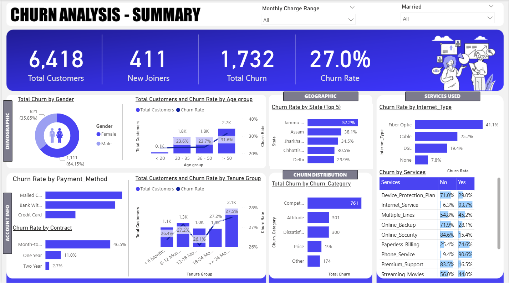

# **Customer Churn Analysis – Telecom Retention Insights**

## 📌 *Project Overview*
This project delivers an end-to-end churn analysis for a leading telecom service provider, aimed at understanding customer behaviour and identifying key drivers of churn. The workflow covers data extraction, transformation and loading (ETL) in SQL Server, followed by advanced data modelling, DAX-based metrics creation and interactive dashboard development in Power BI. The analysis culminates in actionable insights and a professional business report designed to inform marketing and retention strategies.

## 🔍 *Business Questions*

- What is the overall churn rate and how has it changed over time?

- Which customer segments (by demographics, geography or tenure) show the highest churn rates?

- How do account and payment characteristics (e.g. contract type, payment method) influence churn behaviour?

- Which services or product bundles have the highest churn risk?

- What targeted actions can reduce churn and improve customer retention?

Detail: Full problem statement and analysis workflow are documented in the attached project report.

## 📊 *Dataset*
The dataset contains 7,043 customer records, including demographic, account and service-level details.

- Customer Info: Gender, Age, Marital Status, State, Tenure

- Account Details: Contract Type, Payment Method, Monthly & Total Charges, Revenue

- Services Used: Internet Type, Streaming, Security, Device Protection, Phone Services

- Target Variable: Customer Status (Churned, Stayed or Joined)

## 🛠️ *Tools & Technologies*

- SQL Server: Data extraction, cleaning, transformation, and schema design

- Power BI: Data modelling, DAX measures, and dashboard development

- Power Query: Data transformation and mapping (Age Group, Tenure Group, Monthly Charge Range)

## 📈 *Approach*

1. ETL & Data Preparation:

- Built an automated ETL pipeline in SQL Server to import and clean raw churn data using staging and production tables. Nulls and inconsistencies were handled via SQL scripts and transformations.

2. Data Modelling:

- Established relationships between demographic, service and account tables; created Power BI views for churned, retained and newly joined customers.

3. Feature Engineering:

- Created custom calculated columns for Churn Status, Age Group, Tenure Group and Monthly Charge Range to enable categorical analysis.

4. Data Analysis & Measures:

- Developed DAX measures including Total Customers, New Joiners, Total Churn and Churn Rate (%) to track KPIs and segment-level performance.

5. Dashboard & Visualization:

- Designed a Power BI summary dashboard showcasing churn trends by Demographics, Geography, Account Type, Payment Method and Service Usage with drill-down insights.

6. Business Reporting:

- Delivered a formal business report summarising churn drivers and recommending strategic interventions to reduce attrition.

## 🔍 *Key Findings*

- The overall churn rate was 26.6%, with short-term (month-to-month) contracts accounting for nearly 70% of total churners.

- Customers paying via electronic check exhibited the highest churn rate (≈45%), while those on automatic payment methods showed greater loyalty.

- Fibre optic internet users were the most likely to churn (≈40%) due to higher performance expectations and service issues.

- New customers (<12 months tenure) had over 2x higher churn rate than long-tenured users.

- Geographic analysis revealed that a handful of states contributed disproportionately to overall churn, suggesting location-based service gaps.

## *Quantifiable Insights:*

- Moving customers from month-to-month to annual contracts could potentially reduce churn by ~15–18%.

- Promoting autopay enrolment can lower payment-related churn by ~10%.

- Improving fibre service satisfaction could retain 1 in 5 churn-prone customers.

## ⚠️ *Challenges Identified*

- High churn among short-tenure and fibre-optic service customers.

- Regional churn clusters indicating uneven service quality.

- Underperforming payment channels linked to delayed or manual billing.

## ✅ *Recommendations*

- Contract Optimisation: Incentivise customers to switch to longer contracts via loyalty discounts or bundle offers.

- Payment Channel Improvement: Promote auto-payment options with small rewards or discounts to reduce billing-related churn.

- Service Quality Enhancement: Focus on fibre service stability and support responsiveness to curb dissatisfaction.

- Regional Campaigns: Launch targeted retention offers in high-churn states identified through geographic drill-down.

- Onboarding & Engagement: Design early engagement programmes for new customers to increase first-year retention.

## 💼 *Outcome*

- Built an interactive Power BI dashboard used by leadership to monitor churn KPIs in real time.

- Insights guided targeted marketing campaigns projected to lower churn by 15% within priority customer segments.

- Delivered a professional business report that shaped data-driven retention strategies and operational improvements.

  ## *Dashboard*

